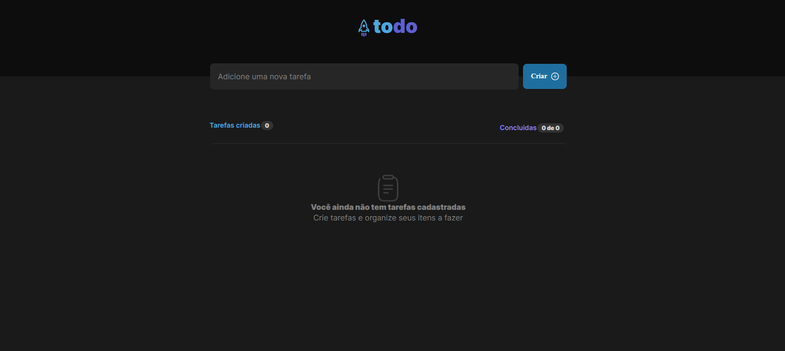
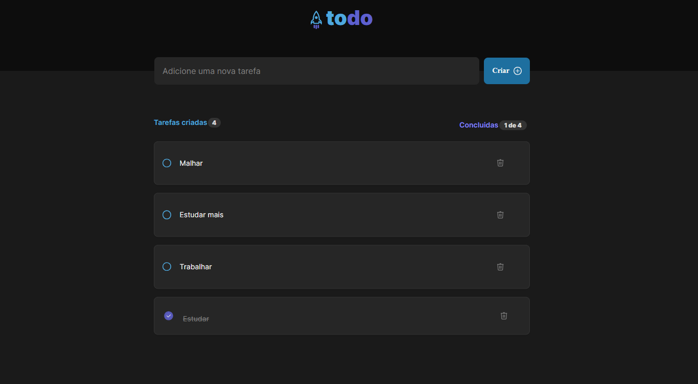
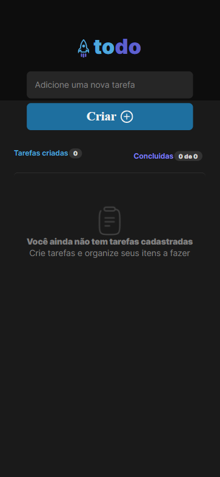
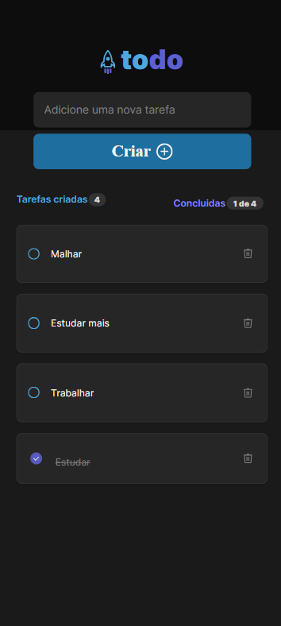

# My todo :notebook:
# React + TypeScript + Vite

 

### 🏷️ About 

A todo  Website

### 💡 Functionalities 

* Create tasks.
* Mark tasks as completed.
* Delete tasks.
* Task Counter
* Completed task counter
* validation
* Responsive

###  🛠️ Built with

* React
* Typescript
* Vite
* Git/GitHub

### 🌐 Website
:link: Link to access the website:
[https://my-todo-dun.vercel.app/](https://my-todo-dun.vercel.app/)

### 📸 Screenshots

### Layout Desktop

### Layout Mobile

### ✒️ Author
## :raising_hand: Thiago Alves

- Linkedin - [Thiago Alves](https://www.linkedin.com/in/thiago-alves-010915274/)
- GitHub - [Thiago87dev](https://github.com/Thiago87dev)
- Frontend Mentor - [@MrThiago87](https://www.frontendmentor.io/profile/MrThiago87)
- Instagram - [@thiagopaulista87](https://www.instagram.com/thiagopaulista87/)
